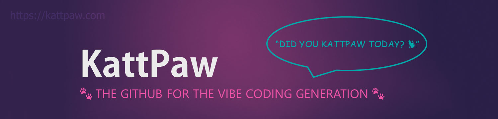
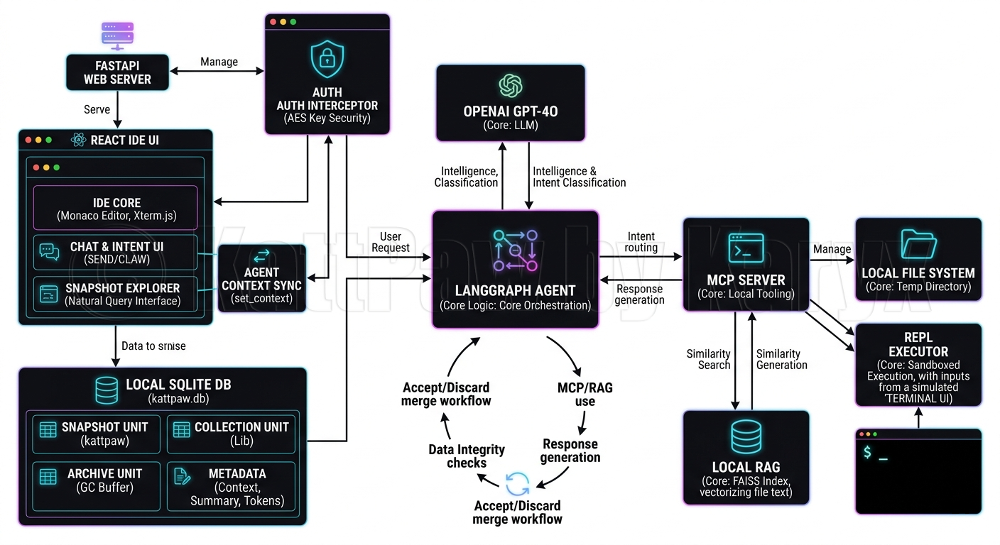
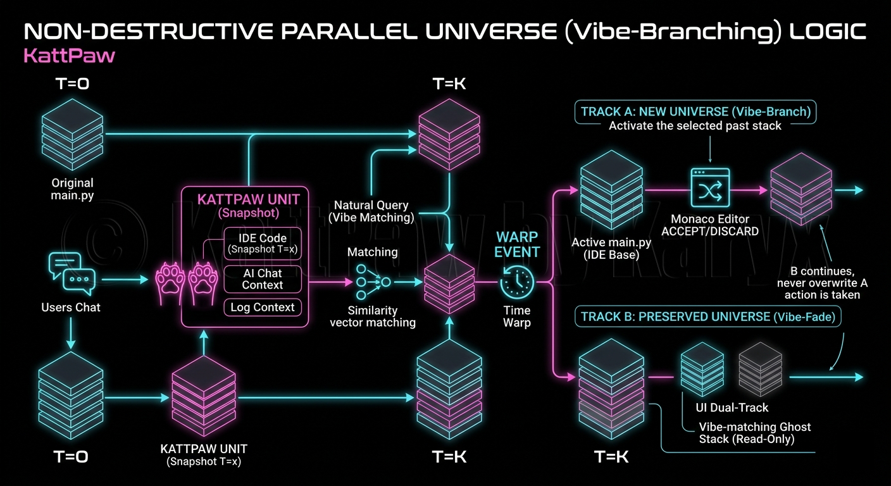
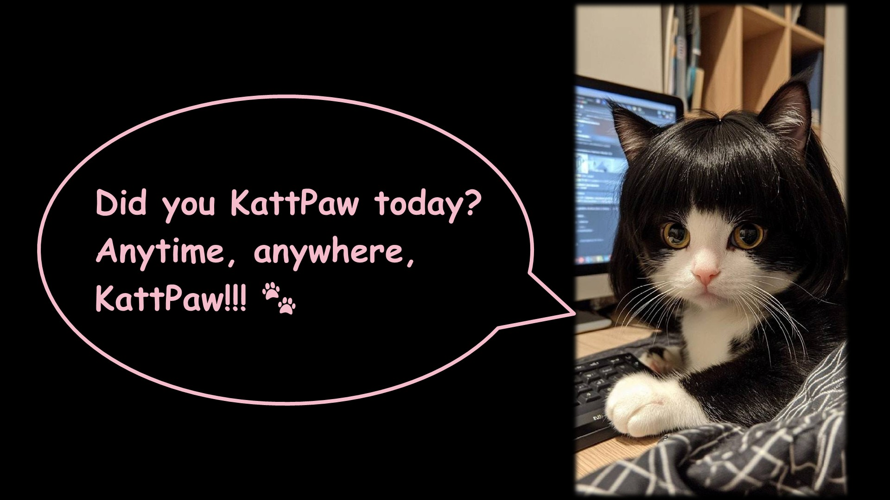
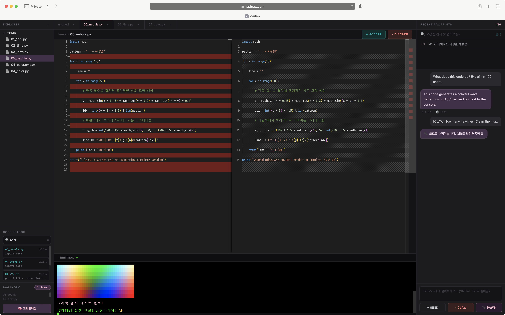

  <h3>Why Version-control your code, when you code by the Vibe?</h3>

> Tired of losing your **Vibe** in a sea of git commits? 
> KattPaw bridges the gap between AI-human dialogue and source code, making experimentation as seamless as a conversation. 
> Until the day engineers ask "Did you KattPaw?" instead of "Did you commit?"! 😤

## **🎥 Feature Highlights**
Current version is optimized for Korean. Multi-language support coming soon!

  <video src="https://github.com/user-attachments/assets/2d4efeb4-c765-455c-a0c9-a0d6041dc82e" width="100%" controls autoplay muted loop>
    Your browser does not support the video tag.
  </video>

## **💻 Project Overview**
### 1. About Project KattPaw: The GitHub for the Vibe Coding Generation
- KattPaw🐾 [kɑːt.pɔː]: It's like French "C", but punchier!

- KattPaw is a browser-native, AI-powered code editor with seamless local file system access. 
KattPaw(깟뽀)는 브라우저에서 실행되면서도 로컬 파일 시스템에 직접 접근할 수 있는 AI 기반 코드 에디터입니다.

- Targeting "Vibe-Coding" beginners and data scientists struggling with experiment management, KattPaw solves the ultimate pain point: context fragmentation. It is a web-based AI Agent IDE that integrates AI conversation history with code versions, providing a continuous development environment anywhere, anytime. 
바이브코딩 붐에 올라탄 입문자들과 복잡한 실험 관리에 어려움을 겪는 데이터 사이언티스트들의 pain point를 공략, AI 대화 맥락과 코드를 함께 저장하고 통합 버전 관리하여, 언제 어디서나 끊김 없는 개발 환경을 제공하는 웹 기반 AI Agent IDE입니다.

- My core technology binds LLM chat history, Code Diffs, and Execution Logs into a single, unified data object. Operating on a BYOK (Bring Your Own Key) model, KattPaw communicates directly with your LLM (currently supporting OpenAI) and offers two specialized agent modes: CONSULT (Contextual Q&A) and CLAW (Autonomous Code Repair). 
LLM과의 대화 내역, 코드 변경분(Diff), 실행 로그를 하나의 데이터 객체로 바인딩하여 저장합니다. 사용자의 LLM API 키를 이용해 모델과 직접 통신하며(현재 OpenAI 지원), 코드 질의응답(CONSULT)과 자동 코드 수정(CLAW)이라는 두 가지 강력한 에이전트 모드를 제공합니다.

- API Key Protection: API keys are encrypted using AES and kept only in your browser's session storage. They are never stored on our server nor transmitted in plain text. 
API 키 보호: API 키는 AES로 암호화되어 사용자의 브라우저 세션 스토리지에만 유지됩니다. 서버에는 절대 저장되지 않으며, 평문 상태로 전송되지 않습니다.

- Commercialization in progress. My unique "Non-Destructive Parallel Universe" logic is Patent Pending. 
**(Application No. 10-2026-0068518, filed on April 15, 2026)** 
현재 상용화 준비 중이며, KattPaw만의 독보적인 "비파괴적 평행우주" 로직은 특허 출원 중 (출원번호: 10-2026-0068518, 출원일: 2026년 4월 15일) 입니다.

- The MVP is live and ready for action at https://kattpaw.com . 
현재 MVP 단계의 서비스가 https://kattpaw.com 에 배포되어 있습니다.

- This MVP was first unveiled and demonstrated during a seminar at the "Fast campus x Upstage: Upstage AI Lab". (Presentation Date: April 17, 2026) 
본 MVP는 Fast campus x Upstage: Upstage AI Lab 세미나를 통해 처음 발표되고 시연되었습니다.

### 2. Timeline
- Apr 6 – Apr 16, 2026: MVP Development Period (11 days)
- Apr 14, 2026: Domain Registered (https://kattpaw.com)
- Apr 15, 2026: Patent Filed (No. 10-2026-0068518)
- Apr 17, 2026: Project Presentation & Showcase
- Apr 18 – May 15, 2026: Paused for AI Competition (OCR/AD/RecSys challenges)
- May 16, 2026 – Future: Post-MVP Production Phase (Planned)

 

> While a solo independent developer built this MVP from scratch in just 11 days (minus 3 days of PMS-induced downtime..😣), someone is buying a VSCode wrapper for $60B? 🤔 
> We're about to witness "Buyer's Remorse 2.0". 😂

## **🏛️ System Architecture**

## **🎨 Core Logic / Data Flow Design**

## **🤖 AI in Action**
> If AI can generate binaries directly without source code, why spend $60B on a tool designed for human developers? 😗 
> Many "visionaries" claim that coding is dead and AI will replace engineers by tomorrow. 
To them, I say: **Don't just buy it, build it yourself.**

#### Hey Conehead, is this too "Advanced" for your $50B check?
- Zero Installation: Pure browser-native.
- Autonomous Debugging: MCP catches errors and suggests fixes before you even blink.
- Parallel Universe: Patented snapshot logic that Cursor will never have.
- BYOK: Bring Your "OpenAI API" Key (Sorry, Grok users 😛) 
TL;DR: Your API key, your bill. I don't have to pay for your model usage!
- Choose Your Fighter: Multi-LLM support is just around the corner. 
Soon, you will be able to select from a variety of LLMs directly on the API Key login page.

## **🔗 Production Site**
This is not an open-source project. As a commercial release is planned, the source code will not be updated publicly. 
본 프로젝트는 오픈소스가 아니며, 상용화 예정인 제품이므로 소스 코드는 공개 또는 업데이트되지 않습니다.
# https://kattpaw.com

## **🚀 Future Roadmap**
### 1. User Experience & Aesthetics (감성 및 인터페이스)
- Interactive Sound Effects: 버튼 클릭 시 "뽀잉~", "깟뽀!", "꾸에엥..", "캬악!" 등 고양이 감성 사운드 추가 (시간 문제로 MVP에서 누락ㅠ)
- AI Voice Modulation (RVC): Karyx의 걸걸한 목소리를 RVC(Retrieval-based Voice Conversion) 기술로 일본 아니메 스타일 미소녀 보이스로 변환하여 시스템 음성으로 활용
- Visual Identity Update: 이모지 중심의 로그인 화면을 간식 상자를 꼭 끌어안고 있는 커다란 치즈고양이 일러스트로 교체
- Multi-LLM Selector: 로그인 전 사용자가 원하는 LLM 모델을 자유롭게 선택할 수 있는 옵션 제공

### 2. Knowledge & Storage Management (우주도서관 & GC)
- Space Library (Cosmic Archive): 파일당 스냅샷 임계치(40개) 도달 시 고양이가 코를 킁킁거리며 나타나 "집사야, 감자 캘 때가 됐다냥!" 알림 발생
- 선택된 스냅샷은 원본과 조립되어 버전 번호 부여 후 우주도서관에 영구 소장 ("쌓아두면 똥이지만 저장하면 지식이 된다.")
- 임계치(50개) 초과 시 오래된 스냅샷은 "소각장"으로 자동 이동
- 고양이 월리 GC: 주기적으로 배치 스케줄러가 실행되어 소각장을 비움. Wally(저작권 회피를 위해 이름은 Wall-E가 아니라 Wally😂)는 일용직 청소부(Garbage Collector)이므로 정해진 시간에 계약된 업무만 하고 사라짐

### 3. Advanced Code Intelligence (지능형 개발 보조)
- Cross-File Refactoring: 전체 프로젝트 구조와 의존성을 파악하여 여러 파일을 동시에 교차 수정하는 로직 구현
- Enhanced Explorer: 파일 삭제, 이름 변경, 폴더 이동 등 전문적인 파일 관리 시스템 확장
- Hybrid Search Engine: 맥락 중심의 Vector Search에 BM25(Sparse Search)를 결합하여 변수명/함수명 등 키워드 검색 정확도 향상

### 4. Explainable AI Agent (신뢰 기반 자율화)
- End-to-End Task Automation: 샌드박스 내에서 에이전트가 파일 생성부터 실행, 디버깅까지 완수하는 자율 기능
- Explainable AI (XAI) Framework:
> 1. Zero-Trust Sandbox (Safety): 허용 구역 외 접근 엄격 차단하여 보안 사고 방지 
> 2. Reasoning Log (Reasoning): 코드 생성 및 수정 시 "왜" 그렇게 했는지 논리적 근거 제시 
> 3. Auto-Reporting (Audit): 에이전트 활동 이력을 자동 문서화하여 **프로젝트 산출물로 즉시 활용**

### 5. Next-Gen Ecosystem (차세대 에코시스템)
- Design-to-Code (OCR): 수기 설계도나 기획서를 분석하여 코드로 즉시 변환 (CV/OCR 대회 기술 적용)
- Self-Healing Test Case: 에이전트가 Pytest 등을 자동 생성하여 코드 검증 후 보고하는 자가 치유 시스템
- AI CI/CD Gateway: Git Hook과 연동하여 커밋 전 보안 취약점 및 컨벤션을 최종 검증
- E2E Ecosystem: 최종적으로 기획-설계-개발-문서화가 하나의 루프로 돌아가는 완전 자동화 시스템 완성

### 6. i18n 지원 외 다수..

## **✨ TEAM SOLO: 물은 셀프 (Self-Service Only)**
<table>
  <tr>
    <td align="center" width="40%">&nbsp;</td>
    <td align="center" width="20%"></td>
    <td align="center" width="40%">&nbsp;</td>
  </tr>
  <tr>
    <td colspan="5" align="center"><b>Karyx💫 (Irene Haan)</b></td>
  </tr>
  <tr>
    <td colspan="5" align="center">역할: 팀장, 팀원, 기획, 디자인, 설계, 인프라 구축, 풀스택 개발, QA, 산출물, 사업관리 (특허료, 도메인 비용, 철야수당 등..🤤)</td>
  </tr>
</table>
 

<b>Copyright © 2026 KattPaw by Karyx💫. All Rights Reserved.</b>

